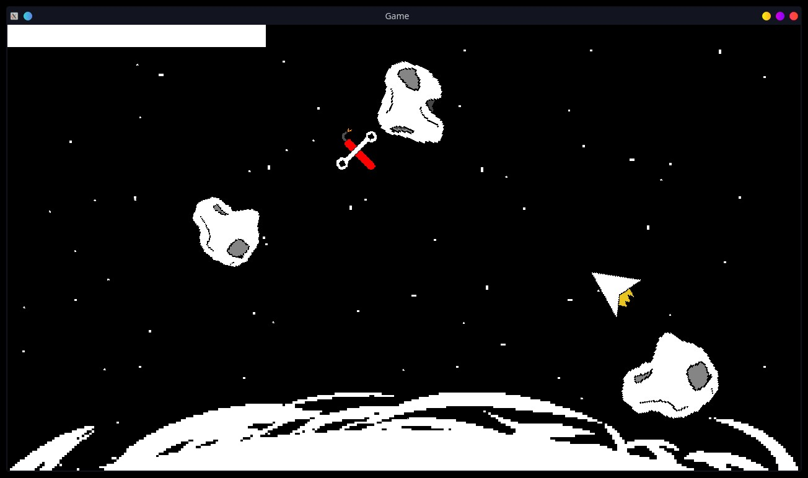

# LD49

### An asteroids-inspired game in <48 hours for Ludum Dare 49.
###### ...jank code ensues
---



## Why?

Short: For fun.

Continuing to learn Rust, now with even more wgpu. Tight deadlines allow to practice planning and establishing priorities. <sup>And give an excuse to write code that *just works*.</sup>

## Build

```shell
$ rustc --version
rustc 1.54.0 (a178d0322 2021-07-26)
$ cargo build --release
```

## Run

```shell
$ cargo run --release
```

## Gameplay

You're on a spaceship trying to escape and orbit around an unstable star. Radiation is constantly damaging your systems. Good thing someone left all those repair kits in space.

White bar on top of the screen is your health. Dodge asteroids, pick up the repair kits. There is no ending.

## Post-LD TODO
- Refactor, a lot

## References
- [Ludum Dare 49 Game Page](https://ldjam.com/events/ludum-dare/49/$260919)